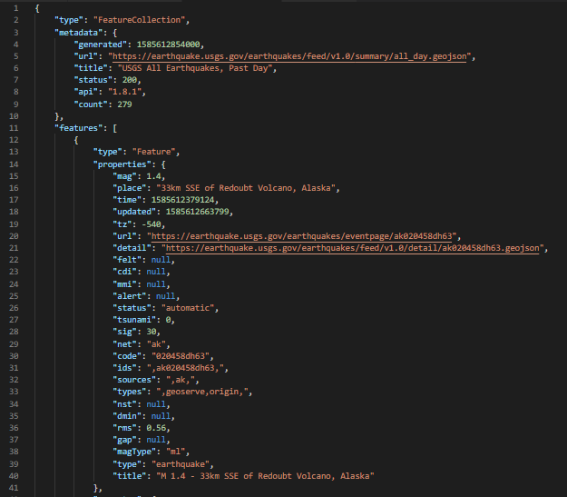
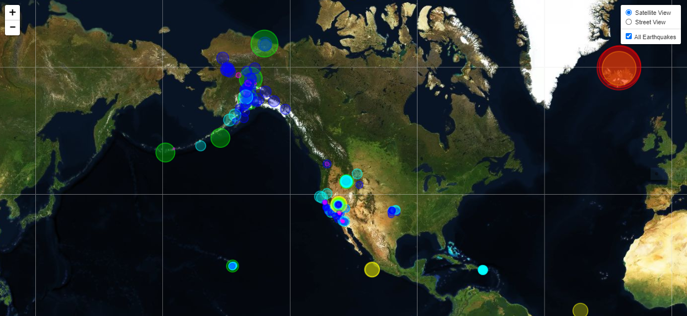

# Visualizing Data with Leaflet

The USGS provides scientific data about natural hazards, the health of our ecosystems and environment, and the impacts of climate and land-use change. They collect data from all over the world each day, which I used to create a data visualization on the occurence of  earthquakes.

### 1. **Choice of a Dataset**

The USGS provides earthquake data in a number of different formats, updated every 5 minutes on the [USGS GeoJSON Feed](http://earthquake.usgs.gov/earthquakes/feed/v1.0/geojson.php). I chose the catagory providing information on all earthquakes in a 24-hour period, which returned a JSON representation of that data.

### 2. **Import & Visualize the Data**

I created an interactive map using Leaflet that plots all earthquakes from the data set based on latitude and longitude.

* Circle markers reflect the magnitude of each earthquake in both size and color. Earthquakes with higher magnitudes appear larger and darker in color.

* Popups on each circle marker provide location, time and magnitude of the earthquake when clicked.

### Copyright

Ben Reiff © 2020. All Rights Reserved.
